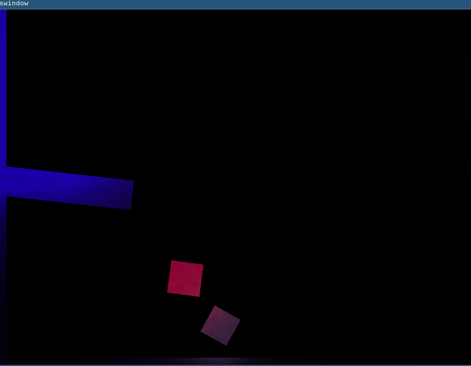

INTRODUCTION

This is a simple application that tests dynamic lighting using OpenGL
shaders. Additionally it also uses Box2D to create a simple world to
demonstrate how the lit objects interact with each other.

SCREENSHOT



DEPENDENCIES

SFML -- for graphics and window

flex + bison -- for parsing "world" files

Box2D -- for simulation

WORLD FILE FORMAT

See the "sample.world" file for a good example, and feel free to
modify to see how the application behaves.

You can assign names to grounds (using the equal sign) in order to
attach lights and joints to them.

```
/* if you specify the optional part, then your ground will be dynamic
and will move around and collide ! */

ground(
	(x, y, w, h),
	(friction, restitution, rotation),
	[(mass, fixed_rotation, linear_damping, angular_damping, hits_player, hits_ground)]
)


/* RGB is in the range of 0.0 to 1.0 */

light(
	(x, y, radius),
	(R, G, B),
	[attached_to]
)

/* distance joint between two ground (distance is assumed to be
whatever distance they start at */

jd(
	a, b
)


/* prismatic joint between two grounds, given an axis. optionally
attach a motor or range limits (hint: if you want range limits without
the motor being enabled, try setting 0 for torque and speed */

jp(
	a, b, (x, y), (axis_x, axis_y),
	[motor_torque, motor_speed],
	[lower_limit, upper_limit]
)

/* revolute joint between two grounds */

jr(
	a, b, (x, y)
	[motor_torque, motor_speed],
	[lower_limit, upper_limit]
)

/* pully joint between two grounds given the two pully points */

jpl(
	a, b, (ax, ay), (ax, ay)
)
```

The Box2D manual explains more about the different joint types as
well.

CREDITS

stone.png texture from https://Kenney.nl

Box2D from http://Box2D.org

SFML from https://sfml-dev.org